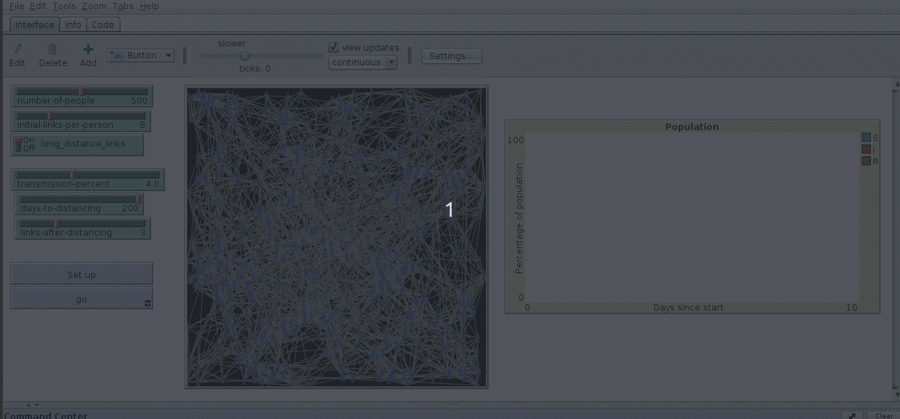
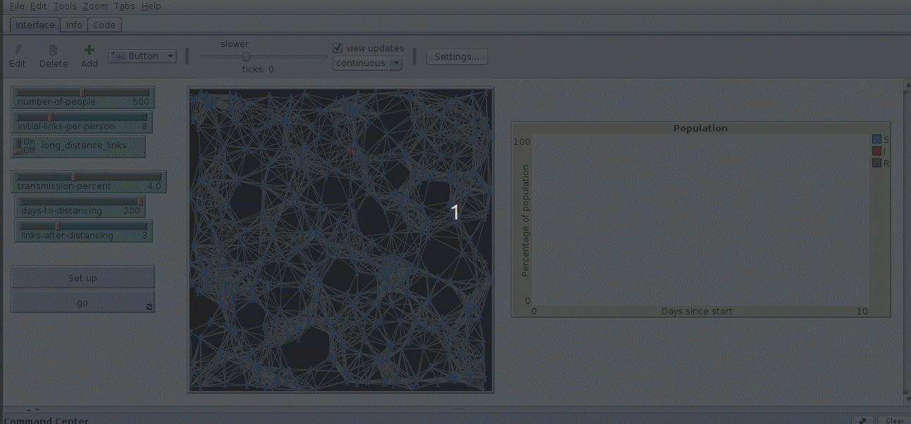
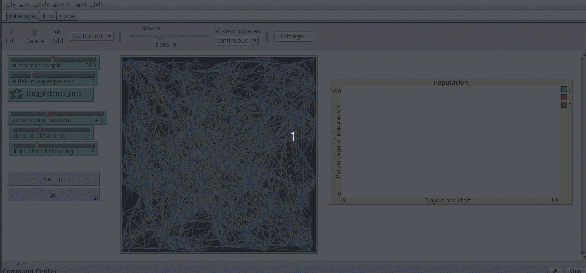
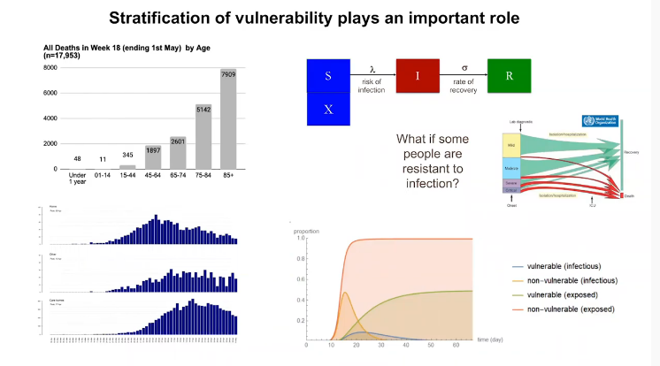

```{r setup, include=FALSE}
knitr::opts_chunk$set(echo = FALSE)
load("workspace2020-05-28.rda")
library(shiny)
library(tidyverse)
require(lubridate)
require(RCurl)
library(dygraphs)
library(xts)
library(lubridate)
library(mapview)
library(sf)
library(leaflet)
library(DT)
library(easynls)
library(deSolve)
```


## What is heuristic modelling?

The term heuristic has changed in meaning in recent years as a result of its use in modern decision theory. Wikipedia defines the word heuristic as applying to "any approach to problem solving or self-discovery that employs a practical method that is not guaranteed to be optimal, perfect or rational, but which is nevertheless sufficient for reaching an immediate, short-term goal." 
An older, and simpler, definition is that applying a heuristic is "a means of enabling a person to discover or learn something for themselves". Under this definition the application of a heuristic model should be **rational**, although it may be neither optimal nor perfect.

Heuristic models have a long tradition of use for didactic purposes. When teaching epidemiological modelling individual based "zombie" models are often used. Computer generated zombies moving and infecting a population in an artificial world provides insights into the fundamental principles underlying the spread and the persistence of an epidemic. Heuristic models are simplified depictions of reality that help us to think clearly. Individual based models such as the zombie world,  with its stochastic dynamics and artificially simplified behaviour are not suitable for making quantitative predictions about the real world. It is quite clear that the real world is not really like the model world.  However the model world does include enough features of the real world to allow us to discover something about it for ourselves.

The classic SIR model of Kermack and McKendrick is also an extremely simple model. The SIR differs from the real world in many respects. It is another heuristic model that answers a question  of the type "what would happen if the world were to be like this?" However the SIR model consists of equations with deterministic mathematical solutions. As the equations can be solved precisely it can be quite tempting to use the model to make precise quantitative predictions. If quantities derived from the SIR such as time varying rates of transmission and $R_0$ values are being used for heuristic purposes then they are best used in conjunction with the SIR model itself. The world is never really as simple as the world implied by the SIR. All models are wrong, but some are useful The SIR is a useful model, but only if all the assumptions used are clearly stated.

## The SIR model

There is a case to be made for considering the SIR model to have been the most successful deterministic differential equation based model of all time with regard to curve fitting. Almost all epidemic outbreaks follow the general pattern of an SIR curve, or its many variants. So the historical evidence in support of the SIR as a tool for estimation is strong. The SIR model provides an underlying framework and vocabulary for epidemiologal modelling and variants of the SIR are widely used when considering zzonotic disease. [@Dorjee2013]. 

The classic SIR model uses three compartments.

S = Susceptible fraction at risk  
I = Infected fraction    
R = Removed fraction (either dead or immune)   

In order to scale the model we also need to know .. 

N = The total population size 


Assume one person starts an epidemic by becoming infected. If the model is being scaled to the population at risk then

$I = 1$

If the model were expressed as proportions of the population then $I = \frac{I}{N}$ 

Let's introduce a parameter for the model to control the rate of transmission between infected individuals and susceptible individuals. We call this $\beta$ (beta). In a model scaled to the population $\beta$ represents the number of new individuals that are infected each time step (usually a day) by an initially infected individual when the rest of the population is completely susceptible.  So, if $\beta = 0.5$ this implies that there will be initially one new infection every two days, on average. Although it can be convenient mentally to think of beta, gamma and the derived $R_0$ in terms of what happens to individuals, in the model they are in fact population level parameters which represent a smoothed "average" result. 

We can write an equation  for transmission like this ..

$\frac {dS}{dt} = - \beta \frac{SI}{N}$

In order to progress with the model we now need to introduce a second parameter, which is typically known as $\gamma$ (gamma). Gamma represents the proportion of the infected population removed (die or become immune) in any one time step. The model now becomes.

$\frac {dS}{dt} = - \beta \frac{SI}{N}$

$\frac {dI}{dt} =  \beta \frac{SI}{N}- \gamma \frac{I}{N}$

$\frac {dR}{dt} =  \gamma \frac{I}{N}$


Because gamma is the proportion of people recovering, or dying, from the illness each time step then 
$\frac{1}{\gamma}$ = the average duration of the illness.  
If $\gamma$ = 0.1 then the illness lasts 10 days, on average.

### The basic reproduction number $R_0$

The basic reproduction number, written as $R_0$, can be thought of as representing the number of new cases that an initial case generates, on average over the course of its own infectious period, assuming all the rest of the population is uninfected. 

An estimate of $R_0$ in a simple SIR model can be made through the $\beta$ and $\gamma$ parameters. Each day the first infected individual will produce $\beta$  new cases. An individual remains infectious for $\frac{1}\gamma$ days. So 

$R_0 \approx \frac{\beta}\gamma$

If $R_0 < 1$ the epidemic clearly will not spread, as fewer than one new case arises as a result of the initial infection. 

As $R_0$ depends on both beta and gamma there is no $R_0$ for a disease as such. The $R_0$ depends on the properties and behaviour of the population. If the individuals mix freely and frequently in environments in which transmission is likely then $R_0$ will be high. If measures are taken to reduce contact then $R_0$ falls. It is important to be aware of the difference between $R_0$ and time variant rate of transmission that some commentators on Covid have begun referring to as R. The actual rate of transmission $\frac {dI}{dt}$ changes as the epidemic progresses and is a function of the fraction susceptible and infected. It is also important to remember that $R_0$ is an average over the population. If one super spreader results in 200 infections this does not imply an $R_0$ of 200, unless each of the subsequent infected people continue to spread the disease in the same way. 


## The panmixia assumption

The panmixia assumption is a central element of the SIRS. More sophisticated models, such as the computer simulation developed by Neil Ferguson, disaggregate populations into different compartments, each one with its own "jumble of parameters" to depict contagion [@Ferguson2020] 
[@Ferguson2006]. Spatial structure is also modelled. Although these more complex models would appear to be able to make more reliable predictions than the SIR through being much more realistic, they can suffer from the "42" issue well known to those familiar with the work of Douglas Adams. It also becomes increasingly difficult to find values for the all the multiple parameters. So work to address one potentially unjustifiable assumption leads to having to make many more assumptions.

Panmixia is often misunderstood as implying that every member of a population has an equal chance of an actual encounter with any other. In fact all that is needed to fulfil the panmixia assumption is for the network of contacts to form a "small world" in which there are pathways between all elements with no more than 5 (or so) links. A small number of long distance linkages are sufficient to [fulfill the small world criteria. See section on network models](#networks)


## Modelling Covid-18 using the SIR

A very clear explanation of the way the SIR model can be used as a heuristic tool for exploring competing hypotheses regarding the trajectory of the Covid-19 epidemic is provided by Sunetra Gupta

https://www.youtube.com/watch?v=huizqoEfvpw

Gupta refers to beta as a "jumble of parameters". This is a good way of looking at the model, as transmission is actually dependent on a complex process of involving the number of contacts between individuals and the consequence of contact. 
Just prior to the declaration of lock down in the UK the group of researchers at Oxford led by Sunetra Gupta published a paper which included a section on fitting a simple SIR model to the data available at the time [@Lourenco2020]. The  model was essentially an interesting piece of heuristic modelling that concluded that many possible models could all "fit" the data available at the time and that serological studies were needed to mediate between alternative models.

@Lourenco2020 was transparent in its assumptions and clarified what was known  to be known, or could at least be estimated, with regard to the disease and what was known to be unknown. Gupta assumed that the actual number of people infected was a "known unknown". There was no point it using numbers derived from testing as the number of tests being conducted was too small and the sample selected for testing was completely unrepresentative. If the number of people with the disease is not known then the severity of the disease and its contagious potential are also unknown.

1. The number of people known to have died of Covid at any point in time is the only reliable indication of the true progress of the disease. This assumption may be questionable if people are dying without being tested, or people are dying of co morbidities with covid but not of covid.  
2. None of the parameters of the SIR are known.
3. The "case fatality ratio" ($CFR = \frac{NumberDeaths}{NumbCases}$) is likely to be much lower than the incidence fatality ratio ($IFR =\frac{NumberInfected}{NumbCases}$) due to low rates of diagnosis.
4. Some ballpark estimates for the IFR can be made with extremely broad ranges based on data from the initial outbreak in China and other emerging sources at the time.

So Gupta's group used the SIR in a heuristic capacity. The logic went like this ..

If we know how many people have died of covid at any one point in the epidemic's trajectory we can estimate the number of people infected in the past through making assumptions regarding the IFR and average time from infection to death. Say the IFR is 0.001 (i.e. 1/1000) with an  average time to death of three weeks. That would imply that one thousand people were infected three weeks before the first recorded death. Of course one data point would be insufficient to work with on its own, but this logic does extend naturally in a computer simulation to take in data from subsequent deaths. Working through the consequences heuristically. If one thousand people were infected three weeks prior to the first case then we can derive the total number of people infected at that point in time by making more assumptions. The $\beta$ "jumble" of parameters that determine transmission need to be guestimated. Say the number of cases at the outset with a completely susceptible population were doubling every 3.5 days. In three weeks the initial thousand cases would have doubled 6 times. This implies around 64 thousand people have already been infected when the first death is noticed. A plausible model with a low IFR and a high $R_0$ implied that a large proportion of the UK population had been infected prior to the lockdown. This result was clearly a difficult one to publicise at the time.

### Multiple competing hypotheses 

One interesting element of the paper was the way that it revealed an intrinsic difficulty in evaluating the fit of all moderately complex models. Gupta's group used the Bayesian technique of Monte Carlo Markov Chain (MCMC) to find credible intervals for key parameters. This is a really good way of formally measuring model uncertainty. However difficulties still arise if multiple local maxima occur in the likelihood function. If very different sets of parameter values produce similar matches to the available data. In this case the model becomes extremely sensitive to all prior assumptions regarding parameter values. To put it another way. If you hold all other parameters constant apart from (say) the incident fatality ratio then you may be able to estimate a ballpark value for the IFR with a formal measure of uncertainty. However, what happens if the region where the optimum falls jumps into a totally different ballpark when you change your assumptions for other parameter such as beta?  You find that different models provide just as good a fit to the data, even though each model represents a completely different hypothesis regarding how the epidemic behaves. 

There is no statistical solution to the problem. The only way to address it is to accept the model as being a heuristic tool. The SIR becomes a classic "what if the world were like this" model. Advising on the right course of action to combat the epidemic is clearly impossible. However as new data comes in some combinations of parameters and assumptions can be ruled out. If the SIR does not fit the data then the assumptions underlying the SIR must be wrong in some respect. The further the predictions lie from the actual data the more the assumptions have been violated. So while it is impossible to find the "right" model, it is easy to rule out models that are very clearly wrong.


```{r}

plot_sir<-function(countries ="United Kingdom",sdate=as.Date("2020-03-01"),immunity=0.2 ,beta=0.5, gamma=0.25, ifr=0.001, burn_in=20)
{
# countries ="United Kingdom"
# sdate=as.Date("2020-03-01")
# immunity<-0.2
# beta<-0.4
# gamma<-0.2
# ifr<-0.001
# burn_in <- 15

d %>% filter(Country %in% countries) %>% arrange(Date) %>% filter(Date > sdate ) ->dd2
days<-length(dd2$NDeaths)
  ### Arrange a data frame for work with just two columns, one being total deaths and the other days,
     
   gdata2<-data.frame(days=1:days, deaths= dd2$NDeaths)
   ## Find the differences (i.e. the daily deaths)
   gdata2 %>% mutate(Daily_deaths = deaths - lag(deaths, default = first(deaths))) %>% arrange(deaths) -> gdata2
   
   gdata2$Daily_deaths[gdata2$Daily_deaths<0]<-NA
   
   N<-dd2$pop[1]  # Population at risk
   init_deaths<-gdata2$deaths[1] +1 # Seed with one extra death just in case there are some situations where there are no deaths to start
   
   init_cases<-init_deaths/ifr ## Dividing by the incidence fatality rate gives the number of cases at the start
   
   
   I <- init_cases/N
   S <- 1-I-immunity
   R <- immunity
   D <- init_deaths/N
  
   
   sd<-run_sir(beta=beta, gamma= gamma, S=S, I=I, days=days+burn_in , D=0, R=R, v=ifr)
  g1<<- dygraph(sd)
    ds<-pivot_longer(sd,cols=2:5)
   ds$value<-ds$value*N

    plot_title<-sprintf("R zero approximately %s",round(beta/gamma,2))
     ds %>% filter(name=="D") %>% mutate(Daily_deaths = value - lag(value, default = first(value))) %>% arrange(value) -> ds2
     ds2 %>% filter(time>burn_in) %>%
     ggplot(aes(x=time,y=Daily_deaths)) + 
     geom_line() + geom_line( aes(y=gdata2$Daily_deaths), col="red") + ggtitle(plot_title) ->>g2
     
      ds %>% filter(name=="D") %>% mutate(Daily_deaths = value - lag(value, default = first(value))) %>% arrange(value) -> ds2
     ds2 %>% filter(time>burn_in) %>%
       ggplot(aes(x=time,y=value)) +
       geom_line() + geom_line( aes(y=gdata2$deaths), col="red") + ggtitle(plot_title) ->> g3
  
}


```

### United Kingdom {.tabset }

#### Low IFR - Gupta type model {.tabset }

Parameter values. 

1. Start date = 2020-03-01  
2. Immunity=0.2  
3. Beta=0.5  
4. Gamma=0.25 
5. IFR=0.001 
6. Average time to death = 24 days


```{r}
plot_sir(countries ="United Kingdom",sdate=as.Date("2020-03-01"),immunity=0.2 ,beta=0.5, gamma=0.25, ifr=0.001, burn_in=20)

```


##### Fit to daily deaths
```{r}
g2
```

##### Fit to cumulative deaths
```{r}
g3
```

##### SIR
```{r}
g1
```


#### High IFR - Ferguson type model {.tabset }

Parameter values. 

1. Start date = 2020-03-01  
2. Immunity=0.2  
3. Beta=0.5  
4. Gamma=0.25 
5. IFR=0.001 
6. Average time to death = 24 days


```{r}
plot_sir(countries ="United Kingdom",sdate=as.Date("2020-03-01"),immunity=0 ,beta=0.5, gamma=0.25, ifr=0.01, burn_in=20)

```


##### Fit to daily deaths
```{r}
g2
```

##### Fit to cumulative deaths
```{r}
g3
```

##### SIR
```{r}
g1
```


## Alternative assumptions

<a name="networks"></a>

### Simulating networks {.tabset } 

#### Long distance transmission routes



#### Only local transmission routes




#### Change from global to local (lockdown)




The process becomes even more difficult to pin down when the population is disaggregated into groups which differ in vulnerability to the virus




## References
