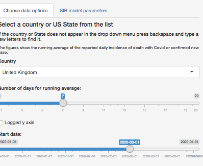
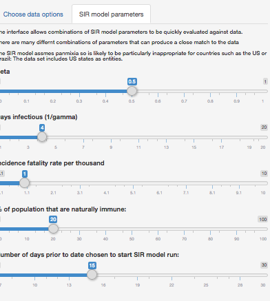
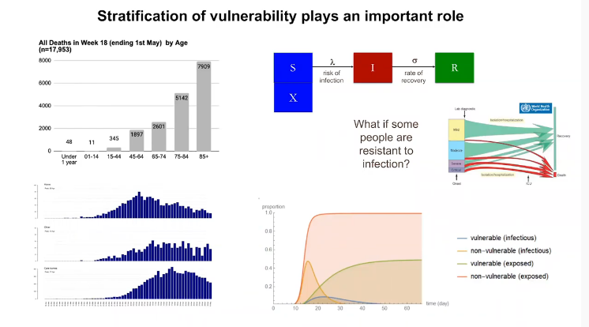
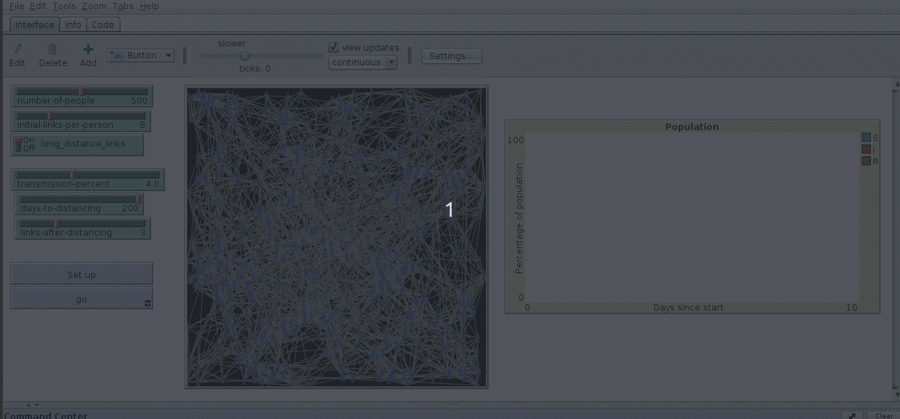
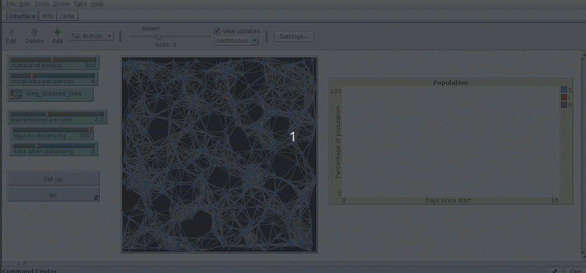
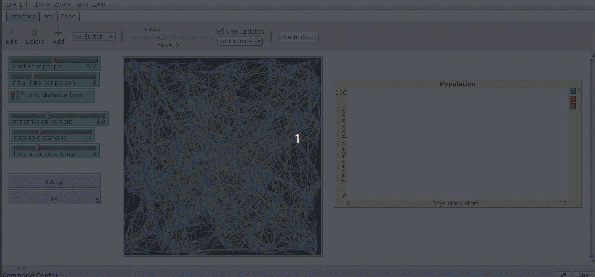

```{r setup, include=FALSE}
knitr::opts_chunk$set(echo = FALSE)
load("workspace2020-05-28.rda")
library(shiny)
library(tidyverse)
require(lubridate)
require(RCurl)
library(dygraphs)
library(xts)
library(lubridate)
library(mapview)
library(sf)
library(leaflet)
library(DT)
library(easynls)
library(deSolve)
```

## Introduction 

This page is very much still under construction. It aims to explain some elements of the model available from the link below, which is also under construction.  

https://dgolicher.shinyapps.io/SIR_Covid/ 

All code included on github 

https://github.com/dgolicher/SIR_covid 


## What is heuristic modelling?

The term *"heuristic"* has changed slightly in meaning over time as a result of its widespread use in decision theory [@Tversky1124]. Wikipedia currently defines the word *heuristic* as "applying to any approach to problem solving or self-discovery that employs a practical method that is not guaranteed to be optimal, perfect or rational, but which is nevertheless sufficient for reaching an immediate, short-term goal." 
An older, simpler, definition is "a means of enabling a person to discover or learn something for themselves". Under this definition the application of a heuristic model should certainly be **rational**, although it may be neither *optimal* nor is it required to be *perfect*.

Heuristic models have a very long tradition of use for didactic purposes. When teaching epidemiological modelling individual based "zombie" models are widely used. Observing computer generated zombies moving around and infecting a susceptible population within an artificial world provides insights into the fundamental principles underlying the spread and the persistence of an epidemic. Heuristic models are simplified depictions of reality. They help us to think more clearly about the properties of a system. Individual based models, such as the zombie world,  with its stochastic dynamics and artificially simplified behaviour are not suitable for making quantitative predictions regarding any real world.  However the model world does still include just enough features of the real world to allow us to discover something about the real world for ourselves.

The classic SIR model of Kermack and McKendrick is another extremely simple model The SIR also differs from the real world in many respects. It is a heuristic model that answers a question  of the type "what would happen if the world were to be like this?" However the SIR model consists of equations with clear deterministic mathematical solutions. As these equations can be solved precisely it is much more tempting to use the model to make precise quantitative predictions. The world is never actually as simple as the world implied by the SIR. All models are wrong, but some are useful.  The SIR is a useful model, but only if all the assumptions involved are clearly stated and critically evaluated. If quantities derived from the SIR such as time varying rates of transmission and $R_0$ values are being used for predictive purposes then they should be used in conjunction with the SIR model itself as the implications of changes to parameters can only be understood within the framework that is used to derive parameters. 

## The SIR model

There is a case to be made for considering the SIR model to have been the most successful deterministic differential equation based model of all time with regard to curve fitting. Almost all epidemic outbreaks do tend to follow the general pattern of an SIR curve, or its many variants. So the historical evidence in support of the SIR as a tool for estimation is strong. The SIR model provides an underlying framework and vocabulary for epidemiologal modelling. Variants of the SIR are widely used when considering zoonotic diseases such as covid-19. [@Dorjee2013]. 

### Compartments

The classic SIR model uses three compartments.

S = Susceptible fraction at risk  
I = Infected fraction    
R = Removed fraction (either dead or immune)   

In order to scale the model we also need to know .. 

N = The total population size 

Assume one person starts an epidemic by becoming infected. If the model is being scaled to the population at risk then $I = \frac{1}{N}$ 

### Beta (transmission)

Let's introduce a parameter for the model to control the rate of transmission between infected individuals and susceptible individuals. We call this $\beta$ (beta). In a model which is scaled to the population size $\beta$ represents the number of new individuals that are infected each time step (usually a day) by an initially infected individual when the rest of the population is completely susceptible.  So, if $\beta = 0.5$ this implies that there will be initially one new infection every two days, on average. Although it can be convenient mentally to think of beta, gamma and the derived $R_0$ in terms of what happens to individuals, in the model they are in fact population level parameters which represent a smoothed "average" result. Beta is also extremely hard to measure or pin down directly. There are many factors that influence contagion. Transmission events are extremely heterogeneous in both space and time. 

We can write an equation  for transmission like this ..

$\frac {dS}{dt} = - \beta \frac{SI}{N}$

### Gamma (removal)

In order to progress with the model we now need to introduce a second parameter, which is typically known as $\gamma$ (gamma). Gamma represents the proportion of the infected population removed (die or become immune) in any one time step. 
The model now becomes.

$\frac {dS}{dt} = - \beta \frac{SI}{N}$

$\frac {dI}{dt} =  \beta \frac{SI}{N}- \gamma \frac{I}{N}$

$\frac {dR}{dt} =  \gamma \frac{I}{N}$


Because gamma is the proportion of people recovering, or dying, from the illness each time step then 
$\frac{1}{\gamma}$ = the average duration of the illness.  
If $\gamma$ = 0.1 then the illness lasts 10 days, on average.

### The basic reproduction number $R_0$

The basic reproduction number, written as $R_0$, can be thought of as representing the number of new cases that an initial case generates, on average over the course of its own infectious period, assuming all the rest of the population is uninfected. 

An estimate of $R_0$ in a simple SIR model can be made through the $\beta$ and $\gamma$ parameters. Each day the first infected individual will produce $\beta$  new cases. An individual remains infectious for $\frac{1}\gamma$ days. So logically 

$R_0 \approx \frac{\beta}\gamma$

If $R_0 < 1$ the epidemic clearly will not spread, as fewer than one new case arises as a result of the initial infection. 

As $R_0$ depends on both beta and gamma there is no $R_0$ for a disease as such. The $R_0$ depends on the properties and behaviour of the population. If the individuals mix freely and frequently in environments in which transmission is likely then $R_0$ will be high. If measures are taken to reduce contact then $R_0$ falls. It is important to be aware of the difference between $R_0$ and time variant rate of transmission that some commentators on Covid have begun referring to as R. The actual rate of transmission $\frac {dI}{dt}$ changes as the epidemic progresses and is a function of the fraction susceptible and infected. It is also important to remember that $R_0$ is an average over the population. If one super spreader results in 200 infections this does not automatically imply an $R_0$ of 200, unless each of the subsequent infected people also continue to spread the disease in the same way. If we start with a large number of infected individuals  (N) and implement contact tracking and tracing then $R_0$ would be (approximately) the sum of all the secondary cases divided by N. 


### The panmixia assumption

The *panmixia* assumption is a key central element of the SIRS. More sophisticated models, such as the computer simulation developed by Neil Ferguson, disaggregate populations into different compartments, each one with its own sets of interlinked parameters  [@Ferguson2020] 
[@Ferguson2006]. Spatial structure is also modelled explicitly. These complex models aim to make more reliable predictions than the SIR through being much more realistic. However they can suffer from the "42" issue The number 42 is well known to those familiar with the work of Douglas Adams. It is the ultimate resolution of a computer model aimed at resolving all doubts regarding life the universe and everything. However as the supercomputer named Deep Thought ran through all its many lines of undocumented code it did not keep track of its workings. When it was asked which question was answered by the number 42 it was unable to answer. Models that answer a question with the number 42 are the exact opposite of heuristic models.
As models become more complex it becomes increasingly difficult to find values for the all the multiple parameters. So work aimed at addressing one potentially unjustifiable assumption leads to having to make many more potentially unjustified assumptions assumptions.  Ironically, the output from even highly complex simulations often appears almost identical in shape and general form to results from the SIR. So the principle of parsimony would encourage the use of the SIR unless some very specific addition to it needs to be tested.

The panmixia assumption of the SIR is often seen as highly problematic. It does break down. However Panmixia is often misunderstood as implying that every member of a population has an equal chance of an actual encounter with any other. In fact all that is needed to fulfil the panmixia assumption is for the network of contacts to form a "small world" in which there are pathways between all elements with no more than 5 (or so) links. A small number of long distance linkages are sufficient to fulfil the small world criteria. The final part fo this document illustrates some concepts using a netlogo model.


## Modelling Covid-19 using the SIR

A very clear explanation of the way the SIR model can be used as a heuristic tool for exploring competing hypotheses regarding the trajectory of the Covid-19 epidemic is provided by Sunetra Gupta's Youtube talk, linked here ...

https://www.youtube.com/watch?v=huizqoEfvpw

Gupta refers to beta as a "jumble of parameters". This is a very good way of looking at the model. Transmission is actually dependent on a complex process of involving the number of contacts between individuals and the consequence of contact. See section on networks.

Prior to the declaration of the lock down in the UK the group of researchers at Oxford led by Gupta published a non peer reviewed paper which included a section on fitting a simple SIR model to the data available at the time [@Lourenco2020]. The  model was essentially an interesting piece of heuristic modelling that concluded that many possible models could all "fit" the data available at the time and that serological studies were urgently needed to mediate between alternative models.

@Lourenco2020 had the virtue of transparency in all its assumptions. The model clarified the *known knowns*, or at least the known estimates, with regard to the covid pandemic The article also stated clearly what elements of the epidemic were at the time best considered to be *known unknowns*. Gupta's group assumed that the actual number of people infected was a *known unknown*. Models that use confirmed cases  as input treat the number of people infected as a *known known*. Failing to incorporate uncertainty into models leads to misleading predictions.

There was no point in using numbers derived from testing as a measure of infections at that point in time, and arguably it is still misleading. The number of tests being conducted was far too small in march and the sample being selected for testing was completely unrepresentative. If the number of people with the disease is not known then the severity of the disease and its contagious potential are also unknown. 

There were however some points of reference that might be used to get some sort of handle on the epidemic.

1. The number of people known to have died of Covid at any point in time is the only reliable indication of the true progress of the disease. This assumption may be questionable if people are dying without being tested, or people are dying of co morbidities with covid but not of covid.  
2. None of the parameters of the SIR are known with certainty. Infectiousness appears to last around 3 to 7 days. The disease had spread very rapidly around the world suggesting  $R_0 > 2, \beta > 0.3$
3. The "case fatality ratio" ($CFR = \frac{NumberDeaths}{NumberCases}$) is likely to be much lower than the incidence fatality ratio ($IFR =\frac{NumberInfected}{NumberCases}$) due to low rates of diagnosis.
4. Some ballpark estimates for the IFR can be made with extremely broad ranges based on data from the initial outbreak in China and other emerging sources at the time.

So Gupta's group set about using the SIR in a heuristic capacity, not to predict the final outcome of the epidemic but to provide a range of scenarios to be investigated through large-scale serological surveys. The logic went something like this ..

If we know how many people have died of covid at a point in the epidemic's trajectory we can estimate the number of people infected in the past through making assumptions regarding the IFR and the average time from infection to death. Say the IFR is 0.001 (i.e. 1/1000) with an  average time to death of three weeks. This would imply that one thousand people were infected three weeks before the first recorded death. (*Of course, one data point would be insufficient to work with on its own, but this logic does extend naturally in a computer simulation to take in data from subsequent deaths.*). If one thousand people were infected three weeks prior to the first case then we can now derive the total number of people infected at that point in time by making more assumptions. The $\beta$ "jumble" of parameters that determine transmission need to be estimated. This can be done to some extent by fitting curves to the initial slope of previous outbreaks in China and Italy Let's assume that the number of cases at the outset (within an almost completely susceptible population) are doubling every 3.5 days. In three weeks the initial thousand cases would therefore have doubled 6 times. This implies around 64 thousand people have already been infected when the first death is noticed. A plausible model with a low IFR and a high $R_0$ implied that a large proportion of the UK population had been infected prior to the lockdown. This result was clearly a difficult one to publicise at the time. The modelling section of the paper was effectively buried.

### Multiple competing hypotheses 

One interesting element of the paper was the way that it revealed an intrinsic difficulty in evaluating the fit of any moderately complex model. Gupta's group used the Bayesian technique of Monte Carlo Markov Chain (MCMC) to find credible intervals for key parameters. This is a really good way of formally measuring model uncertainty. However difficulties still arise if multiple local maxima occur in the likelihood function. Very different sets of parameter values can produce similar matches to the only available data. In this case the model becomes extremely sensitive to all the prior assumptions regarding ranges of parameter values. If, for example, you hold all other parameters constant apart from (say) the incident fatality ratio then you may be able to estimate a ballpark value for the IFR with a formal measure of uncertainty. However, what do you conclude if the region where the optimum falls then jumps into a totally different ballpark as soon as you change your assumptions for other parameter, such as beta?  In this case different models provide just as good a fit to the data, even though each model represents a radically different hypothesis regarding how the epidemic behaves! One model may predict a coming apocalypse while another predicts a severe flu season. Which do you believe? How can you possibly tell? Setting vague priors on all parameters just crashes the algorithm used for fitting.

There is no purely statistical solution to this sort of problem. The only way to address it is to accept that the model is being used as a heuristic tool. The SIR is just another "what if the world were like this" type model. Choosing a single definitive course of action to combat the epidemic is impossible. 

However the approach can be useful. The papers by @Lourenco2020 and  @Ferguson2020 were both written prior to the start of the lockdown. As new data has come in it is now possible to reuse the @Lourenco2020 type model in conjunction with new data. This may help to rule out some combinations of parameters and assumptions can be ruled out. If the SIR does not match the data at all then some of the assumptions underlying the model must be wrong. This could imply either that the SIR framework itself is inadequate, that the parametrisation is wrong or both are wrong. The further the predictions lie from the actual data the more the assumptions have been violated. So while it is impossible to find the "right" model, it is now not quite as hard to rule out models that are very clearly wrong.

## Implementing the SIR in R 

### Using Johns Hopkins data as input

On the date of writing (`r Sys.Date()`) the Johns Hopkins github repository provides real time data on Covid-19 monitoring for 232 countries and 52 states in the USA. The epidemic curve has now peaked in at least half the countries and states. This provides data that can be used to test the match between the pattern of mortality predicted by various different parametrisations of the SIR and the actual epidemic trajectory.

The shiny app available from the link below allows the user to select data on any country.
Click on the link to run the application
https://dgolicher.shinyapps.io/SIR_Covid/

#### Choose country and smoothing tab

The left hand panel has two tabs. The first tab is for choosing a country or US state. The geographical entities are arranged in order of epidemic severity at the date the application is run. The whole data base can be searched by pressing backspace to clear the menu box and tying a few letters to find the country or state. The running averages are used for displaying the empirical patterns in cases and deaths as reported by Johns Hopkins.




#### Model interface tab

The model interface tab on the left hand panel allows the input to a superimposed SIR model to be chosen. The model is initiated using the deaths data from the country on the date chosen in the previous tab. The model adopts the same approach as that adopted by @Lourenco2020. Although the Johns Hopkins data set contains information on case numbers these are **not** used in the model. The model runs with a "burn in" period which corresponds to the average time from infection to death in cases that result in mortality. 

The model output is very highly sensitive to choices regarding the incidence fatality rate. Small alterations to this parameter propagate through the entire model run as they affect the build up of the epidemic and the eventual outcome in terns of mortality. Low values for incidence fatality rates imply high levels of contact with covid within the community. 
The interface also allows the user to select a value for the fraction of the population that has some form of immunity at the start of the epidemic. In March both Ferguson and Gupta assumed that as the virus is novel that no immunity would be present within the community. The evidence for immunity remains ambiguous. However given the extremely low proportion of children under 14 developing symptoms it is plausible to believe that children may combat covid with either an inherent immune response or some other mechanism.



  
#### Evaluating the match to the date

There are two ways to evaluate the match of the model to the data. The main panel of the interface plots model output over daily deaths and the cumulative total of deaths.
It is tempting to use the word **fitting** to describe this process. However that would be wrong. Model fitting involves using formal statistical criteria (e.g. maximising the likelihood) to evaluate the closeness of output and data. Model matching uses the observer's own heuristics to match the output in order to test hypotheses. A poorly "fitting"" model can have more heuristic value than a model that "fits" the data very well. In fact, models that provide good matches to the data can be more misleading if they provide a good fit for all the wrong reasons. 

### Model code

All the code for the shiny app is available here. 

https://github.com/dgolicher/SIR_covid

This is a work in progress. Much of the code concerns downloading the Johns Hopkins data and visualising. The core of the model is a set of differential equations representing a slightly modified SIR which takes into account delayed mortality of hospitalised patients after the initial population level infected period. The flows within the model are conceptually related to the schematic diagram presented by Gupta.




In the model as implemented here all infected individuals would first be placed in the infected compartment and then sorted into those who become severely ill and eventually die and those who return to the community with immunity.

The equations are solved for the initial starting conditions and parameters chosen by the user. Clicking on the code tab to the right in this document will show the equations as written for use by the desolve library in R.

```{r, eval=FALSE,echo=TRUE}

sir <- function(time, state, parameters) {
  
  with(as.list(c(state, parameters)), {
    
    dS <- -beta * S * I  # Classic SIR
    dI <-  beta * S * I - gamma * I  # Classic SIR
    dR <- gamma * I * (1-v)  # v is used to represent the IFR of the disease and takes a (small) value set on the interface to lie between 0.01 and 0.001
    dH <- gamma * I * v  # A proportion of the infected fraction are placed in the H compartment (hospital)
    dD <- gamma2 * H  # All the proportion in the H compartment are converted to deaths through a second gamma that leads to an exponential decay in the hospitalised fraction decided upon by the IFR parameter (v). 
    
    return(list(c(dS, dI, dR,dH,dD)))
  })
}

## All the run_sir parameters are actually set from the shiny interface. 
run_sir<-function(beta, gamma, days, S,I, v, R, D, H, gamma2)
{
  parameters <- c(beta = beta,gamma=gamma, v=v, gamma2=gamma2)
  init<- c(S = S, I = I,R = R, D=D, H=H)
  times<- seq(0, days, by = 1)
  out <- ode(y = init, times = times, func = sir, parms = parameters)
  d <- as.data.frame(out)        
  d
}

```


```{r}

plot_sir<-function(countries ="United Kingdom",sdate=as.Date("2020-03-01"),immunity=0.2 ,beta=0.5, gamma=0.25, ifr=0.001, burn_in=20)
{
# countries ="United Kingdom"
# sdate=as.Date("2020-03-01")
# immunity<-0.2
# beta<-0.4
# gamma<-0.2
# ifr<-0.001
# burn_in <- 15

d %>% filter(Country %in% countries) %>% arrange(Date) %>% filter(Date > sdate ) ->dd2
days<-length(dd2$NDeaths)
  ### Arrange a data frame for work with just two columns, one being total deaths and the other days,
     
   gdata2<-data.frame(days=1:days, deaths= dd2$NDeaths)
   ## Find the differences (i.e. the daily deaths)
   gdata2 %>% mutate(Daily_deaths = deaths - lag(deaths, default = first(deaths))) %>% arrange(deaths) -> gdata2
   
   gdata2$Daily_deaths[gdata2$Daily_deaths<0]<-NA
   
   N<-dd2$pop[1]  # Population at risk
   init_deaths<-gdata2$deaths[1] +1 # Seed with one extra death just in case there are some situations where there are no deaths to start
   
   init_cases<-init_deaths/ifr ## Dividing by the incidence fatality rate gives the number of cases at the start
   
   
   I <- init_cases/N
   S <- 1-I-immunity
   R <- immunity
   D <- init_deaths/N
  
   
   sd<-run_sir(beta=beta, gamma= gamma, S=S, I=I, days=days+burn_in , D=0, R=R, v=ifr)
  g1<<- dygraph(sd)
    ds<-pivot_longer(sd,cols=2:5)
   ds$value<-ds$value*N

    plot_title<-sprintf("R zero approximately %s",round(beta/gamma,2))
     ds %>% filter(name=="D") %>% mutate(Daily_deaths = value - lag(value, default = first(value))) %>% arrange(value) -> ds2
     ds2 %>% filter(time>burn_in) %>%
     ggplot(aes(x=time,y=Daily_deaths)) + 
     geom_line() + geom_line( aes(y=gdata2$Daily_deaths), col="red") + ggtitle(plot_title) ->>g2
     
      ds %>% filter(name=="D") %>% mutate(Daily_deaths = value - lag(value, default = first(value))) %>% arrange(value) -> ds2
     ds2 %>% filter(time>burn_in) %>%
       ggplot(aes(x=time,y=value)) +
       geom_line() + geom_line( aes(y=gdata2$deaths), col="red") + ggtitle(plot_title) ->> g3
  
}


```

## Examples of model runs

When using the model it is important to interpret all output in terms of **heuristic value**. The model must not be used for quantitative **prediction**.  The output represents one single iteration of the adapted SIR model. A model designed for predictive purposes which formally combined uncertainty regarding initial parameter values would be run many thousands of times in order to produce credible intervals for quantities of interest. However as interactions between parameters result in many different local maxima in a likelihood profile models with diffuse priors would not converge. So a prior hypothesis would be required to fit the model. The purposes of the heuristic tool is to assist in the formulation of hypotheses, not to predict. 

### United Kingdom {.tabset }

Flick between the tabs to see alternative realisations and outcomes.

#### Low IFR - Gupta type model {.tabset }
Parameter values.   

1. Start date = 2020-03-01  
2. Immunity=0.2  
3. Beta=0.5  
4. Gamma=0.25 
5. IFR=0.001 
6. Average time to death = 24 days

```{r}
plot_sir(countries ="United Kingdom",sdate=as.Date("2020-03-01"),immunity=0.2 ,beta=0.5, gamma=0.25, ifr=0.001, burn_in=20)

```


##### Fit to daily deaths
```{r}
g2
```

##### Fit to cumulative deaths
```{r}
g3
```

##### SIR
```{r}
g1
```

##### Comments


This model provides a very convincing fit to the current data. The match between the number of daily deaths and the SIR predicted curve is good, although the model predicts a faster drop off in mortality than observed. This is sadly to be expected, as many people infected with Covid die many weeks or months after initial infection. The SIR curve does predict that most of the population will have been infected.This seems to contradict the seroprevalence studies currently emerging. However a very similar model curve can be obtained by increasing the proportion with immunity (or resistance) to the disease at the outset. This is consistent with other published work with which Gupta has been associated [@Thompson2019]. However see the section on heuristic network modelling for an alternative explanation for the match.


#### High IFR - Ferguson type model {.tabset }
Parameter values.   

1. Start date = 2020-03-01    
2. Immunity=0.2    
3. Beta=0.5   
4. Gamma=0.25 
5. IFR=0.01  
6. Average time to death = 24 days  
  
```{r}
plot_sir(countries ="United Kingdom",sdate=as.Date("2020-03-01"),immunity=0 ,beta=0.5, gamma=0.25, ifr=0.01, burn_in=20)

```


##### Fit to daily deaths
```{r}
g2
```

##### Fit to cumulative deaths
```{r}
g3
```

##### SIR
```{r}
g1
```

##### Comments


The model does not provides any sort of fit to the current data. The match between the number of daily deaths and the SIR predicted curve is very poor, The SIR curve does predict that most of the population will have been infected. The number of cumulative deaths reaches the 0.5 million mark predicted by 
[@Ferguson2020]. The NHS capacity would have been overwhelmed in this scenario, even though $R_0$ is no different to the Gupta scenario. Either lockdown worked very effectively (see comments on network models for how this might have worked outside the SIR framework) or the IFR was set much too high.


### New York {.tabset }

#### IFR three times higher than London {.tabset }
Parameter values.    

1. Start date = 2020-03-01    
2. Immunity=0.2    
3. Beta=0.47    
4. Gamma=0.2   
5. IFR=0.003   
6. Average time to death = 21 days   
 
```{r}
plot_sir(countries ="New York",sdate=as.Date("2020-03-01"),immunity=0.2 ,beta=0.47, gamma=0.2, ifr=0.0028, burn_in=16)

```


##### Fit to daily deaths
```{r}
g2
```

##### Fit to cumulative deaths
```{r}
g3
```

##### SIR
```{r}
g1
```

##### Comments


The model provides a reasonable match to the actual death data. The iFR (and case fatality ratio) was indeed at least three times higher in New York than in Lonodon. New York would apriori be expected to be the city most at risk of an epidemic due to high population density and high levels of social contact (subway etc). However the demographic profile does not differ greatly to London. 


#### No lockdown scenario. Increase beta to 0.8 {.tabset }
Parameter values.   
 
1. Start date = 2020-03-01   
2. Immunity=0.2    
3. Beta=0.8    
4. Gamma=0.2   
5. IFR=0.003   
6. Average time to death = 21 days  

```{r}
plot_sir(countries ="New York",sdate=as.Date("2020-03-01"),immunity=0.2 ,beta=0.8, gamma=0.2, ifr=0.0028, burn_in=16)

```


##### Fit to daily deaths
```{r}
g2
```

##### Fit to cumulative deaths
```{r}
g3
```

##### SIR
```{r}
g1
```


##### Comments

As the IFR was meningfully higher in New York if the epidemic had spread at a faster rate health capacity would have been easily overwhelmed. This scenario shows that minor differences in unknown parameters can have major consequences. At the same time the overall outcome of the epidemic in terms of total cumulative deaths is very similar. If this had occurred many of the deaths would have been of individuals who would not have been able to receive treatment. 


## What if the SIR framework is inadequate?


When matching SIR model output to real life data the user should be constantly criticising the underlying framework used for modelling. If the SIR assumptions are seriously violated then the SIR could be very seriously misleading. 

Model matching does suggest that covid-19 may have a very low IFR and that collective immunity should result in the epidemic dying out. However this interpretation does not necessarily take into account the potential for an effective lock down to completely break the SIR model through preventing even an approximation to panmixia. How can this element be incorporated. 

The issue returns to Gupta's "jumble of parameters" that are summarised by beta. This jumble of parameters is actually associated with a network. Formal network analysis is an important part of epidemiological modelling, but it is not well integrated with models using the SIR. More complex computer simulations simulate networks, but do not use formally derived mathematical properties of networks in a mathematically tractable form [@Ferguson2003]. 

One way of addressing the problem is to return to heuristic modelling and look at artificial networks. To cut a long story short, these can be implemented easily in netlogo providing no attempt is made to use real life parameters. Investigating the behaviour of these models may help to cast light on the effects of lockdown on the SIR


### Simulating networks {.tabset } 

#### Long distance transmission routes

The simulation below includes moderate numbers of local links between individuals with a few, occasional, long distance links. The distances may be thought of as either geographical distances (km) or social distances (meeting individuals outside the usual social circles). All simple simulations suggest that only a few long distance links are sufficient to produce epidemic dynamics that approximate to panmixia. So (say) if one person travels from an epidemic epicentre (London) to a distant part of the network (Durham) this could ensure panmixia.



#### Only localised transmission routes

If all long distance links are removed and the number of contacts restricted the epidemic takes a very different trajectory to the SIR curve. The curve is essentially "flattened". Although the epidemic may eventually infect the entire population it will tend to spread slowly through the socially or geographically linked network. This is essentially the situation that a lockdown was designed to produce. If taken to the limit an extremely effective restriction in linkages breaks transmission and the epidemic quickly dies out. If a lockdown is less effective the curve flattens, but a "second wave" would occur as soon as long distance transmission and enhanced local connectivity is restored.





#### Change from global to local (effective lockdown)


A very effective lockdown can potentially produce a curve that closely mimics the SIR. This occurs if the disease is spreading very quickly prior to the lockdown, and the lockdown is then very effective. The behaviour might look superficially rather like an SIR curve with many individuals developing immunity. However rather than being a removed section of the population at risk through immunity or death, the removed section of the population is essentially an "unreachable" proportion. It is well worth considering this model as a heuristic. Empirical support for the model would be provided by either sudden collapses of the epidemic after lockdowns are implemented and/or rapid second waves occurring in geographically (or socially) novel areas of the network if lockdowns are relaxed. while infections are still present. 





## References
